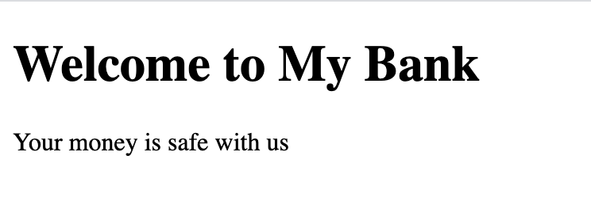
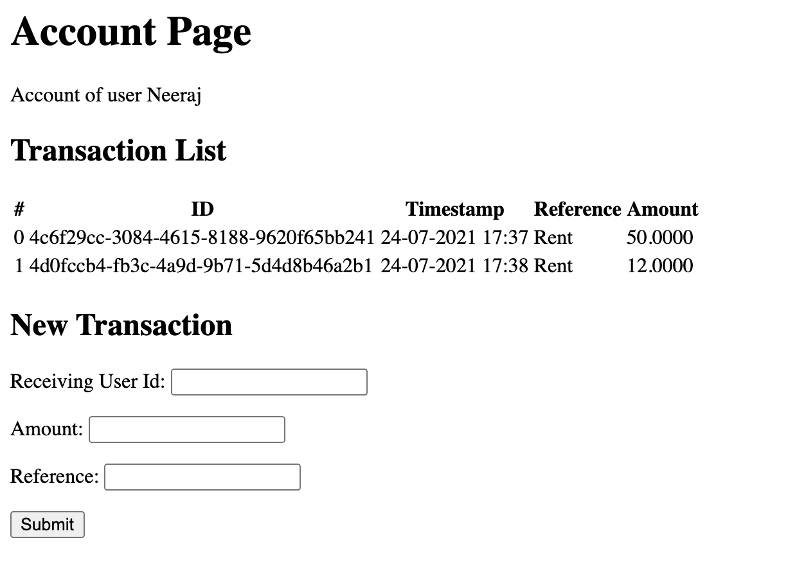
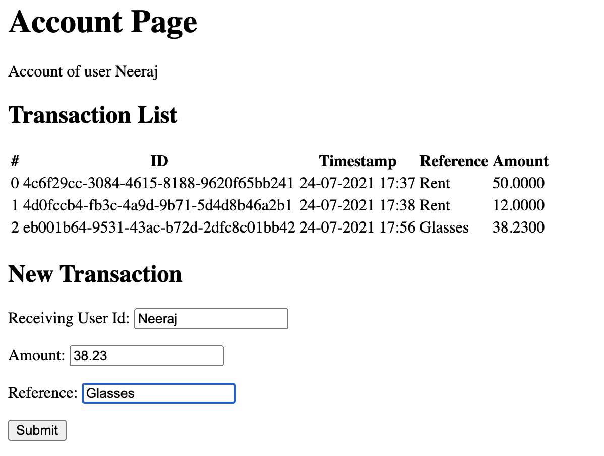

# MyBank

A simple Java web-app based on `Spring Web MVC` with an embedded `Tomcat` container. `H2` database is used for persistence and `Thymeleaf` is used as the template library.

## Run the project

1. First, `git clone` the project locally.

1. There’s two ways to run the application:
    * If you have an IDE like `IntelliJ`, import the project in `IntelliJ` and run the main method of `ApplicationLauncher` class.
    * Else, run `mvn package` which will create a `jar` with embedded tomcat &  run `java -jar target/receipts-1.0-SNAPSHOT.jar`.

1. Using `Postman`, hit the below endpoints.

## Welcome Page

Open http://localhost:8080/ to see the welcome page saying:



## GET Endpoints

1. GET http://localhost:8080/transactions : Returns all the transactions

    ```json
    [
        {
            "id": "4c6f29cc-3084-4615-8188-9620f65bb241",
            "amount": 50.0000,
            "timestamp": "2021-07-24T17:37+0530",
            "reference": "Rent",
            "bankSlogan": "Your money is safe with us",
            "receivingUserId": "Neeraj"
        },
        {
            "id": "4d0fccb4-fb3c-4a9d-9b71-5d4d8b46a2b1",
            "amount": 12.0000,
            "timestamp": "2021-07-24T17:38+0530",
            "reference": "Rent",
            "bankSlogan": "Your money is safe with us",
            "receivingUserId": "Neeraj"
        }
    ]
    ```

1. GET http://localhost:8080/unregisteredPath : Returns `404 Not Found`.

## POST Endpoints

1. **Note**: You need to pass a non-empty `amount`, `reference` and  `receivingUserId` to the API via request body. The application will create a `UUID` and `bankSlogan` on its own.

1. POST http://localhost:8080/transactions with `{"amount": 15.0, "reference": "iPhone", "receivingUserId": "John"}` as request body: Creates a new transaction with the following JSON response

    ```json
    {
        "id": "bd2ac395-78ca-453f-9c4e-67df3510604d",
        "amount": 15.0,
        "timestamp": "2021-07-24T17:42+0530",
        "reference": "iPhone",
        "bankSlogan": "Your money is safe with us",
        "receivingUserId": "John"
    }
    ```

1. POST http://localhost:8080/transactions with `{"amount": 15.0, "reference": "", "receivingUserId": "John"}` as request body: Returns `400 Bad Request` as an empty `reference` is invalid.

    ```json
    {
        "errorMsg": "Validation failed for argument [0] in public com.neeraj.mybank.model.Transaction com.neeraj.mybank.web.TransactionController.createTransaction(com.neeraj.mybank.dto.TransactionDto): [Field error in object 'transactionDto' on field 'reference': rejected value []; 
        codes [NotBlank.transactionDto.reference,NotBlank.reference,NotBlank.java.lang.String,NotBlank]; 
        arguments [org.springframework.context.support.DefaultMessageSourceResolvable: codes [transactionDto.reference,reference]; 
        arguments []; 
        default message [reference]]; default message [must not be blank]] ",
        "fieldNames": [
            "reference"
        ]
    }
    ```

1. POST http://localhost:8080/transactions with `{"amount": null, "reference": "laptop", "receivingUserId": "John"}` as request body: Returns `400 Bad Request` as a _null_ `amount` is invalid.

    ```json
    {
        "errorMsg": "Validation failed for argument [0] in public com.neeraj.mybank.model.Transaction com.neeraj.mybank.web.TransactionController.createTransaction(com.neeraj.mybank.dto.TransactionDto): [Field error in object 'transactionDto' on field 'amount': rejected value [null]; 
        codes [NotNull.transactionDto.amount,NotNull.amount,NotNull.java.math.BigDecimal,NotNull]; 
        arguments [org.springframework.context.support.DefaultMessageSourceResolvable: codes [transactionDto.amount,amount]; arguments []; 
        default message [amount]]; 
        default message [must not be null]] ",
        "fieldNames": [
            "amount"
        ]
    }
    ```

1. POST http://localhost:8080/unregisteredPath : Returns `404 Not Found`.

## Account Page

1. Open http://localhost:8080/account/Neeraj to see the `Account Page` for the given `receivingUserId`. It will show all the existing transaction as an `HTML`. Following is the output:

    

1. You can also fill up the required values in the `form` and submit the `form` to create a new transaction. It will update the list immediately.

    
